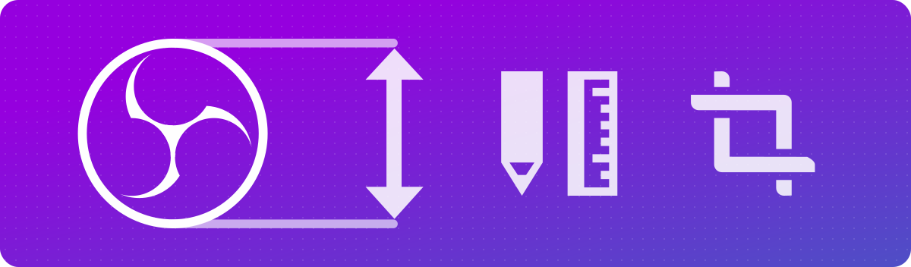

# Design Resources for OBS Studio

 
This repository contains the visual assets (illustrations, custom icons, etc)
and design material (mockups, experiments, etc) used in OBS Studio.

Nothing in this repository is final or representative of what next releases of
OBS Studio will contain.

All work is distributed under the Creative Commons Zero v1.0 Universal license.

### Folder Layout

 * **icons**: icons used in the mockups
 * **illustrations**: drawings and colorful illustrations used in mockups
 * **mockups**: mockups that are more or less ready for implementation
 * **resources**: templates widgets, containers, windows, and patterns used by
   the mockups
 * **whiteboard**: highly experimental, crazy ideas that probably won't ever be
   included in the app

### Contributing

If you'd like to contribute with design work, please join the `#development`
channel in our [Discord][discord] server and get in touch.

This repository is used by members of the OBS Studio community to track ongoing
work, and to host assets used by the project. It is not a general-purpose issue
tracker. If you want to share your ideas and suggestions to the project, please
use the [Ideas and Suggestions][ideas-and-suggestions] page.

Please do not file issues nor open discussions in this repository. Please avoid
participating in discussions or issues that you were not explicitly requested
to participate.

### Code of Conduct

This repository operates under the [Code of Conduct][code-of-conduct], and all
communications and content must adhere to it at all times.

[code-of-conduct]: https://github.com/obsproject/obs-studio/blob/master/COC.rst
[discord]: https://obsproject.com/discord
[ideas-and-suggestions]: https://ideas.obsproject.com/
